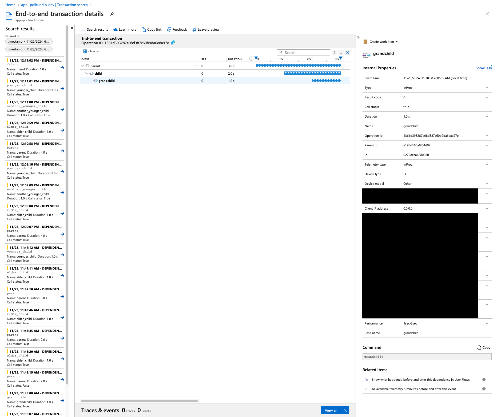
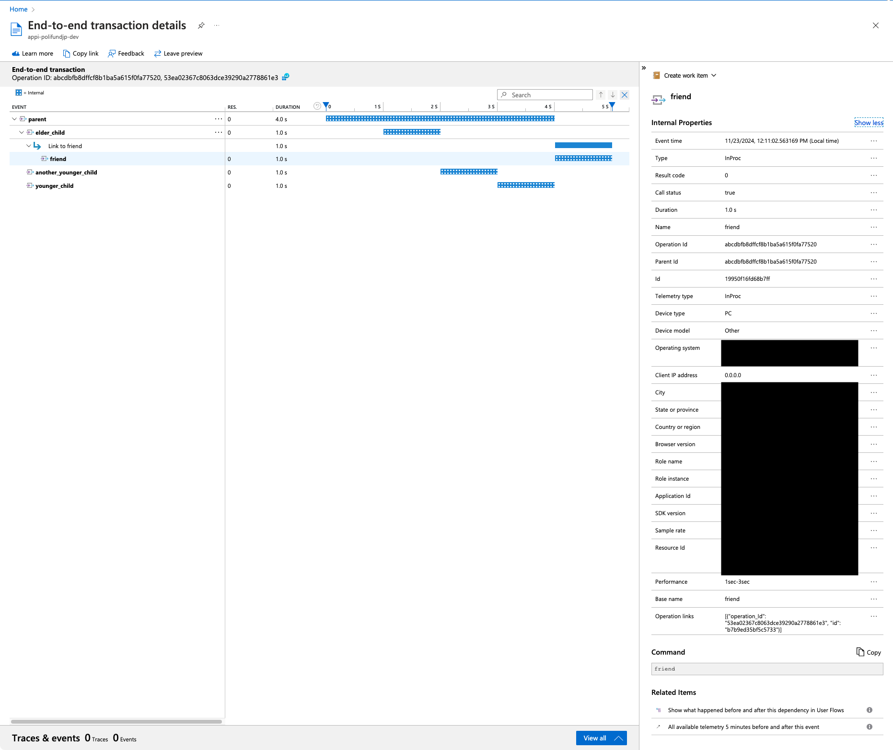

# Random thoughts on how to link OTel traces

Let me record what I tried and thought when instrumenting OTel to data processing pipelines.

I'm using Python, and this article is specific to the OTel library for Python.

## Pareent-child vs. link

Here is a simple sample of a parent-child relationship:

```python
with tracer.start_as_current_span('parent'):
    sleep(1)
    with tracer.start_as_current_span('child'):
        sleep(1)
        with tracer.start_as_current_span('grandchild'):
            sleep(1)
```

Here is the recorded traces on Application Insights:



Here is a sample of a link relationship:

```python
with tracer.start_as_current_span('parent'):
    sleep(1)
    with tracer.start_as_current_span('elder_child') as elder_child_span:
        elder_child_context = elder_child_span.get_span_context()
        sleep(1)
    with tracer.start_as_current_span('another_younger_child'):
        sleep(1)
    with tracer.start_as_current_span('younger_child', links=[Link(elder_child_context)]):
        sleep(1)
with tracer.start_as_current_span('friend', links=[Link(elder_child_context)]):
    sleep(1)
```

Here is the recorded traces on Application Insights:



As you can see, Application Insights seems not to link spans in a same parent span on its UI.
But linked spans across different parent spans are linked on the UI.

## How to get a span context from a distributed context

```python
from opentelemetry.propagate import get_global_textmap

context = {}
with tracer.start_as_current_span('parent'):
    sleep(1)
    with tracer.start_as_current_span('child'):
        sleep(1)
        with tracer.start_as_current_span('grandchild'):
            get_global_textmap().inject(context)
            sleep(1)


context
{'traceparent': '00-3d8a45b9d9efe607da9a63ea8f7021d6-269517c1217e1e26-01'}

extracted_context = get_global_textmap().extract(context)

extracted_context
{'current-span-2c1b45e7-aaae-4751-994e-aec08746a84b': NonRecordingSpan(SpanContext(trace_id=0x3d8a45b9d9efe607da9a63ea8f7021d6, span_id=0x269517c1217e1e26, trace_flags=0x01, trace_state=[], is_remote=True))}

extracted_context['current-span-2c1b45e7-aaae-4751-994e-aec08746a84b']
NonRecordingSpan(SpanContext(trace_id=0x3d8a45b9d9efe607da9a63ea8f7021d6, span_id=0x269517c1217e1e26, trace_flags=0x01, trace_state=[], is_remote=True))

span = extracted_context['current-span-2c1b45e7-aaae-4751-994e-aec08746a84b']

span.get_span_context()
SpanContext(trace_id=0x3d8a45b9d9efe607da9a63ea8f7021d6, span_id=0x269517c1217e1e26, trace_flags=0x01, trace_state=[], is_remote=True)
```

